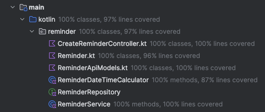

REVIEW
======

CreateReminderControllerTest gives 97% lines covered in total

FIRST

Isolated - This test could fail if the reminder could not be created and if the response format changed
Repeatable
Timely - No because we just made it at the end

Test desiderata

Behaviour - Yes it test a behaviour
Structure insensitive -yes it's not taking into account the structure
Readable - No! the calculation of the date is actually not easy to read, we need to think it twice X
Easy to write - Yes
Fast - Yes
Deterministic - No! as we're using LocalDateTime.now which change on every execution, this could lead to flaky test

Automated - Yes
Isolated - No, because we're using LocalDateTime.now and that could make our tests fail for reasons not related with the code
Composable ??
Specific - No, it could fail because the code is not working, because the date is not properly format
Predict production - No, it's only covering the happy path not the rest of the scenarios
Inspiring - No for me